## JavaScriptreview2025
## [JavaScriptReview](https://www.w3schools.com/JS/default.asp)

## JavaScript first lesson
[firstlesson](https://www.w3schools.com/js/default.asp)
Why Study JavaScript?
JavaScript is one of the 3 languages all web developers must learn:

   1. HTML to **define** the content of web pages

   2. CSS to specify the **layout** of web pages

   3. JavaScript to **program the behavior** of web pages
**If you try all the examples, you will learn a lot about JavaScript, in a very short time!**

The only way to become a clever programmer is to:

Practice coding! Practice coding! Practice coding!


Commonly Asked Questions
How do I get JavaScript?
Where can I download JavaScript?
Is JavaScript Free?
You don't have to get or download JavaScript.

JavaScript is already running in your browser on your computer, on your tablet, and on your smart-phone.

JavaScript is free to use for everyone.

## lesson 2
[JavaScript Introduction](https://www.w3schools.com/js/js_intro.asp)

## JavaScript Where to 
[JavsScript](https://www.w3schools.com/js/js_whereto.asp)


## JavaScript Functions and Events

A JavaScript function is a block of JavaScript code, that can be executed when "called" for.
A JavaScript function is a blovk of JavaScript code, that can be executed when "invoked" for.
## placing the script in <body> 
Placing scripts at the bottom of the <body> element improves the display speed, because script interpretation slows down the display.
## external script
External JavaScript Advantages
Placing scripts in external files has some advantages:

It separates HTML and code
It makes HTML and JavaScript easier to read and maintain
Cached JavaScript files can speed up page loads
To add several script files to one page  - use several script tags:

## JavaScript Output
[JavaScript Output](https://www.w3schools.com/js/js_output.asp)
 Changing the innerHTML property of an HTML element is the most common way to display data in HTML
##  window object
In JavaScript, the window object is the global scope object. This means that variables, properties, and methods by default belong to the window object. This also means that specifying the window keyword is optional:
## for debuging purpose console.log()
For debugging purposes, you can call the console.log() method in the browser to display data.
## JavaScript Syntax rules
[JavaScript Rules](https://www.w3schools.com/js/js_syntax.asp)

## JavaScript Keywords
The keywords let ,const keywords create variables.

**Note**:JavaScript keywords are case-sensitive.

## JavaScript Variables

Variables are containers for storing data values.
Variables must be identified with unique names.

## JavaScript Idendifiers
An identifier is the name you give to a variable.
Rules for identifiers:
- Must start with a letter, _, or $;
* Can contain digits after the first character 
+ Are case-sensitive 
## JavaScript Operators

JavaScript assignment operators(=) assign values to variables:
## JavaScript Expressions

[JavaScript Expressions](https://www.w3schools.com/js/js_syntax.asp);
An expression is a combination of values,variables,and operators,which computes to a value.
## JavaScript is Case Sensitive
The variables lastName and lastname,are different 
## JavaScript and Camel Case
[JavaScript and CamelCase](https://www.w3schools.com/js/js_syntax.asp)
Historically, programmers have used different ways of joining multiple words into one variable name:

Hyphens:

first-name, last-name, master-card, inter-city.

Hyphens are not allowed in JavaScript. They are reserved for subtractions.

Underscore:

first_name, last_name, master_card, inter_city.

Upper Camel Case (Pascal Case):

FirstName, LastName, MasterCard, InterCity.


Lower Camel Case:

firstName, lastName, masterCard, interCity.

JavaScript programmers tend to use lower camel case.

## JavaScript Statements
[JavaScript Statements](https://www.w3schools.com/js/js_statements.asp)

## JavaScript Programs
A computer program is a list of "instructons" to be "executed" by a computer.
These programming instructions are called **statements**.
Most JavaScript programs contain many statements.
The statements are executed,one by one, in the stame order as they are written.

**Note** In HTML, JavaScript programms are executed by the **web browser**.

## JavaScript Statements
JavaScripts statemetns are composed of :
Values, Operators , Expressions, Keywords, and Comments.

**Note** JavaScript programs (and JavaScript statements) are often called JavaScript code.

On the web, you might see examples without semicolons.
**Ending statements** with semicolon is not required, but highly recommended.
## JavaScript White Space
[JavaScript](https://www.w3schools.com/js/js_statements.asp)

JavaScript **ignores** multiple spaces. You can add white space to your script to make it more readable.

The following lines are equivalent:

## JavaScript Line Length and Line Break

## JavaScript Code Blocks
JavaScript statements can be grouped together in code blocks, inside curly brackets {...}.

The purpose of code blocks is to define statements to be executed together.
One place you will find statements grouped together in blocks, is in javaScript functionsl.
## JavaScript KeyWords
JavaScript Keywords
Keyword	Description
var	Declares a variable
let	Declares a block variable
const	Declares a block constant
if	Marks a block of statements to be executed on a condition
switch	Marks a block of statements to be executed in different cases
for	Marks a block of statements to be executed in a loop
function	Declares a function
return	Exits a function
try	Implements error handling to a block of statements
## JavaScript comments
## JavaScript variables
[Javascript variables](https://www.w3schools.com/js/js_variables.asp)

## Variables = Data Containers

JavaScript variables are containers for data.
There are fours ways to declared.
Modern JavaScript
- Using let
- Using const 
Older JavaScript
- Using var (not recommended)
- Automatically (Not Recommended)

JavaScript Identifiers
Variables are identified with unique names called identifiers.

Names can be short like x, y, z.

Names can be descriptive age, sum, carName.

The rules for constructing names (identifiers) are:

Names can contain letters, digits, underscores, and dollar signs.
Names must begin with a letter, a $ sign or an underscore (_).
Names are case sensitive (X is different from x).
Reserved words (JavaScript keywords) cannot be used as names.

**Note**
Numbers are not allowed as the first character in names.

This way JavaScript can easily distinguish identifiers from numbers.

## JavaScript Underscore (_)

JavaScript treats underscore as a letter.
indentifiers containing_ are valid variable names:
## JavaScript Dollar Sign $ as a letter.

Declaring JavaScript Variables

**Creating a variable**  in JavaScript is called declaring a variable

Declare a variable use let 
After the declaration, **the variable has no value (technically it is undefined).**
```
let className;
```

To assign a value to the variable, use the equal sign:
```
className=1D;

## Declaring a Variable Using const

Always use const if the value should not be changed

```
const carName="BMW";


## Declaring a Variable Automatically
```
x=5;
y=6;
z=x+y;
```
**Note** It is a good programming practice to declare all variables ***at the beginning of the script***

## Declaring a Variable Using var
The key word **var** was used before 2015;
**let ,const** is used after 2015;
## When to Use var, let, or const?
1. Always declare variables

2. Always use const if the value should not be changed

3. Always use const if the type should not be changed (Arrays and Objects)

4. Only use let if you cannot use const

5. Never use var if you can use let or const.
## JavaScript Data Types
JavaScript can hold **8 dataTypes**
right now just think **string**  **number**
Inside **quotes**  is treated "string"
Outside quotes is number 
the other : Array,function,object,Boolean,Undefined,Null,

You're correct! In JavaScript, a variable can hold values of 8 fundamental data types. Here they are:

1. **String**: Represents textual data.  
   Example: `"Hello"`

2. **Number**: Represents both integer and floating-point numbers.  
   Example: `42`, `3.14`

3. **BigInt**: For large integers beyond the safe range for Number.  
   Example: `1234567890123456789012345678901234567890n`

4. **Boolean**: Represents logical entities; either `true` or `false`.  
   Example: `true`

5. **Undefined**: Indicates that a variable has not been assigned a value.  
   Example: `undefined`

6. **Null**: Represents the intentional absence of any object value.  
   Example: `null`

7. **Symbol**: Used to create unique identifiers for objects.  
   Example: `Symbol("id")`

8. **Object**: Used to store collections of data and more complex entities (includes arrays, functions, dates, etc.).  
   Example: `{ name: "Alice" }`, `[1, 2, 3]`, `function() {}`

If you want code examples or deeper explanations for any of these types, let me know!

## one statement  many variables

A declaration can span multiple lines:
```
let person ="charles",
    carName="Audi",
    price=18877667;
    ```

    在 JavaScript 中，等号 `=` 是**赋值运算符**，意思是“把右边的值赋给左边的变量”。它**不是**“等于”的意思。

举例：
```javascript
let x = 5;
```
这里，`x` 被赋值为 5。


## The Assignment Operator

**Note** The equal to operator is written like == in JavaScript.
---

在**代数**（数学）中，等号表示左右两边相等。例如：
```
x = 5  // 意思是 x 的值等于 5
```
等号只是表达“相等”的关系。

---

**区别举例：**

在 JavaScript 里，你可以写：
```javascript
x = x + 1;
```
意思是：把 x 的当前值加 1，再赋值回 x。
如果 x 原来是 2，执行后 x 就变成 3。

但在代数里，这样写没有意义：
```
x = x + 1
```
因为没有任何数字能等于它本身加 1（不成立）。

**总结：**
- JavaScript 的 `=` 是赋值，不是“等于”。
- 代数里的 `=` 是表示“等于关系”，而不是赋值。

如果你想表示“等于”，在 JavaScript 要用 `==` 或 `===`：
- `==` 检查值是否相等（类型可以不同）
- `===` 检查值和类型都相等

例如：
```javascript
if (x === 5) {
  // x 等于 5 时执行这里
}
```

## JavaScrip let
[JavaScript let](https://www.w3schools.com/js/js_let.asp)

Variables declared with let have Block Scope

Variables declared with let must be Declared before use

Variables declared with let cannot be Redeclared in the same scope、、


Variables declared inside a { } block cannot be accessed from outside the block:

```
{
  let x = 2;
}
// x can NOT be used here
```
## 
What is Good?
let and const have block scope.

let and const can not be redeclared.

let and const must be declared before use.

let and const does not bind to this.

let and const are not hoisted.


Variables defined with let are also hoisted to the top of the block, **but not initialized**.
你的代码有如下问题：

```javascript
try {
    carName = "bmw";
    let carName;
} catch (err) {
    document.getElementById("demo").innerHTML = err;
}
```

**问题分析：**
- 你先给 `carName` 赋值，再用 `let` 声明它。这违反了 JavaScript 的**变量提升和重复声明规则**。
- 在 ES6 (let/const) 以后，变量不能在同一作用域内重复声明，也不能在声明前赋值（会出现“暂时性死区”）。
- 这样写会导致**SyntaxError: Identifier 'carName' has already been declared** 或 **ReferenceError**。

**调试结果：**
- 代码会直接报错，catch 捕获到的 `err` 是一个错误对象，通常内容为 `"Identifier 'carName' has already been declared"`。

**正确写法举例：**
如果你想声明并赋值，应该这样写：
```javascript
let carName;
carName = "bmw";
```
或者合并为一行：
```javascript
let carName = "bmw";
```

**如何显示错误信息：**
假设你的 HTML 有 `<div id="demo"></div>`  
执行后会显示错误信息。

**完整例子：**
```html
<div id="demo"></div>
<script>
    try {
        carName = "bmw";
        let carName;
    } catch (err) {
        document.getElementById("demo").innerHTML = err;
    }
</script>
```
页面会显示类似：  
`SyntaxError: Identifier 'carName' has already been declared`

---

**结论：**  
- 不能在用 `let` 声明变量前赋值，也不能重复声明。
- 变量应该先声明再使用。

如需进一步解释变量提升或作用域，欢迎继续提问！

## JavaScript Const
[JavaScript ](https://www.w3schools.com/js/js_const.asp)

When to use JavaScript const?
Always declare a variable with const when you know that the value should not be changed.

Use const when you declare:

A new Array
A new Object
A new Function
A new RegExp
## Constant Objects and Arrays


The keyword const is a little misleading.

It does not define a constant value. It defines a **constant reference** to ***a value***.

Because of this you can NOT:

Reassign a constant value
Reassign a constant array
Reassign a constant object
But you CAN:

Change the elements of constant array
Change the properties of constant object

## JavaScript 8 types

[JavaScript types](https://www.w3schools.com/js/js_types.asp)

JavaScript has 8 Datatypes
A JavaScript variable can hold 8 types of data:

Type	Description
String	A text of characters enclosed in quotes
Number	A number representing a mathematical value
Bigint	A number representing a large integer
Boolean	A data type representing true or false
Object	A collection of key-value pairs of data
Undefined	A primitive variable with no assigned value
Null	A primitive value representing object absence
Symbol	A unique and primitive identifier

```

//String
let color ="Yellow";
let lastName="Wang";

// Number
let length =16;
let weight=7.5;

//BigInt
let x =1234567890123456789012345n;;
let y=BigInt(1234567890123456789012345);

//Boolean
let x=true;
let y=false;

//Object
const person={firstName:"John",age:59,nationnality:Usa};
// Array object
const cars =["Saa","Volvo","BWM"];

//Date object
const date=new Date("2022-03-15");

//Undefined
let x;
let y;
// Null
let x =null;
let y=null;

//Symbol
const x=Symbol();
const y=Symbol();

```

## Typeof Operator 
You can use the JavaScript typeof operator to find the type of the JavaScript variable.

The typeof operator returns the type of a variable or an expression:

JavaScript Strings

A string(a text string) is a series of characters like "Charles wong";
Strings are written with quotes. You can use 
single or double quotes:

## JavaScript Numbers
[JavaScript Numbers](https://www.w3schools.com/js/js_types.asp)
## Exponential Notation
[Exponential Notation](https://www.w3schools.com/js/js_types.asp)

Exponential Notation

## JavaScript Booleans

JavaScript booleans can only have one of two values: true or false.


Datatype undefined

In computer programs. 
A variable without a value has the datatype **undefined**.
A variable without a value also haa the value ***undefined***
## Empty Values
 [Empty Values](https://www.w3schools.com/js/js_types.asp)

 ## JavaScript Operators
 [JavaScript Operators](https://www.w3schools.com/js/js_operators.asp)

 Operators are for Mathematical and Logical Computations
The Assignment Operator = assigns values
The **Assignmenet Operator** = assigns values


The Addition Operator + adds values

The Multiplication Operator * multiplies values

The Comparison Operator > compares values

## JavaScript Assignment
The Assignment Operator (=) assigns a value to a variable:
The **Assignment Operator** (=) assigns a value to a variable.

## Types of JavaScript Operators
1. Arithmetic Operators
2. Assignment Operators
3. Comparison Operators
4. Logical Operators
5. And more ...
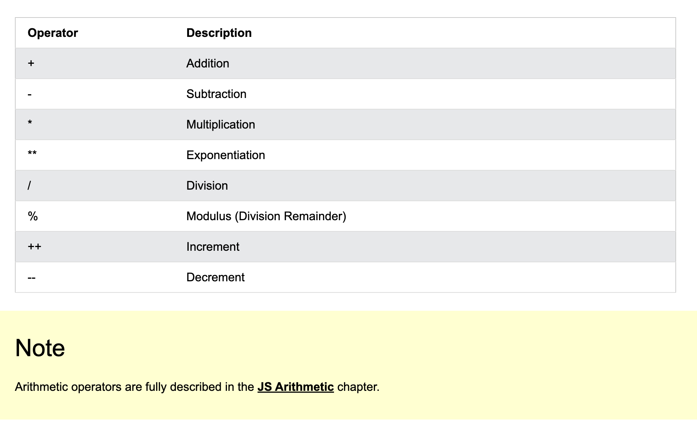
## JavaScript String Addition

The += assignment operator can also be used to add (concatenate) strings:
**+=** assignment operator .can also be used ot add (concatenate) stings;

**Note** If you add a number  and string, the result will be a string!

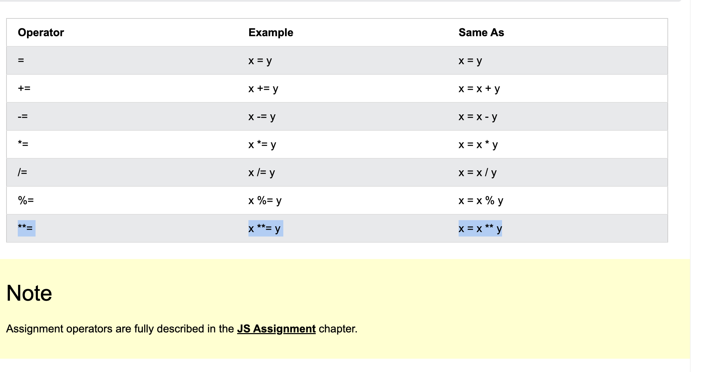


## JavaScript Comparison Operators
Comparison operators are used to compare two values.

Comparison operators always return true or false.

All comparison operators can be used in string;.
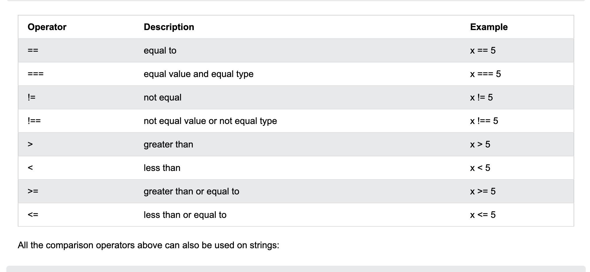

## JavaScript Logical Operators


## JavaScript Arithmetic
JavaScript Arithmetic
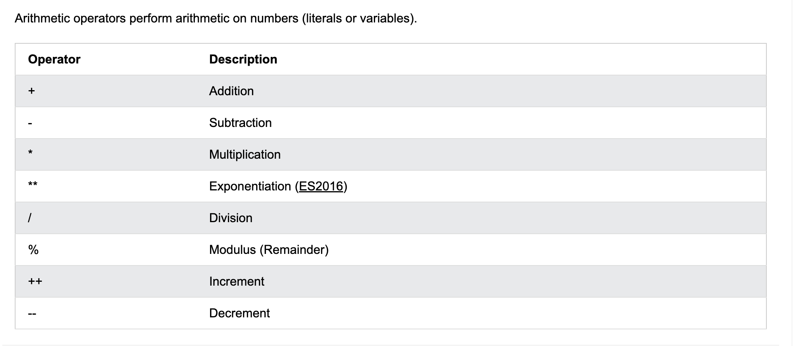


## JavaScript Assignment

[JavaScript Assignment](https://www.w3schools.com/js/js_assignment.asp)


## The &&= Operator
The Logical AND assignment operator is used between two values.

If the first value is true, the second value is assigned.

## The ||= Operator

The Logical OR assignment operator is used between two values.

***If the first value is false***, the second value is assigned.

当然，下面是“??=” 运算符的翻译和解释：

---

### 中文翻译与解释

**??= 运算符（空值合并赋值运算符）**  
??= 运算符用于两个值之间。

- 如果第一个值是 `undefined` 或 `null`，就会把第二个值赋给第一个变量。
- 如果第一个值不是 `undefined` 或 `null`，则保持原值，不做赋值。

#### 例子
```javascript
let a;
a ??= 10; // a 现在是 10

let b = null;
b ??= 20; // b 现在是 20

let c = 5;
c ??= 30; // c 还是 5，因为不是 undefined 或 null
```

#### 总结  
- `x ??= y` 等价于：如果 `x` 是 `null` 或 `undefined`，就让 `x = y`
- 否则 `x` 保持原来的值。

---

如果你想知道它和 `||=`、`&&=` 的区别，也可以随时问我！

## Spread Operator
[Spread Operator ](https://www.w3schools.com/js/tryit.asp?filename=tryjs_assign_spread)

这段代码的作用是：求出字符串 `"12345"` 中各个数字字符的最小值和最大值，并显示在网页上。

下面详细解释每一行：

---

```javascript
let text = "12345";
```
- 声明变量 `text`，内容是字符串 `"12345"`。

---

```javascript
let min = Math.min(...text);
let max = Math.max(...text);
```
- `...text` 是**展开运算符**（spread operator），会把字符串 `"12345"` 拆成单个字符：`'1'`, `'2'`, `'3'`, `'4'`, `'5'`。
- `Math.min(...text)` 实际等价于 `Math.min('1', '2', '3', '4', '5')`
- `Math.max(...text)` 也是同理。
- **注意：**
  - 虽然 `Math.min`/`Math.max` 设计用来处理数字，但 JavaScript 会自动把字符串数字 `'1'`、`'2'` 等转换为数字进行比较。
  - 所以结果就是最小值 `1`，最大值 `5`。

---

```javascript
document.getElementById("demo").innerHTML =
"Minimum is: " + min + "<br>Maximum is: " + max;
```
- 把结果显示在 `<div id="demo"></div>` 这个元素里。
- 显示内容类似：
  ```
  Minimum is: 1
  Maximum is: 5
  ```

---

### 补充说明
- 如果字符串里有非数字字符，比如 `"123a5"`，`Math.min(...text)` 会得到 `NaN`，因为 `'a'` 不能转换为数字。
- 这种用法简单快速地求字符串中每个字符的最大/最小值，适合处理全是数字字符的字符串。

---

如果你有更复杂的数据或想处理数组、对象等，也可以告诉我！

## JavaScript Comparison
[JavaScript Comparison](https://www.w3schools.com/js/js_comparisons.asp)

这段代码的作用是：用 JavaScript 判断变量 z 的值是否“等于”字符串 "9"，并把结果显示在页面上。

下面详细解释：

---

```javascript
let z = 9;
```
- 声明变量 z，并赋值为数字 9（注意：是数字，不是字符串）。

---

```javascript
document.getElementById("demo2").innerHTML = (z == "9");
```
- 这里用到了 `==` （双等号），是“宽松相等”运算符。
- `z == "9"` 意思是：判断变量 z （数字 9）和字符串 "9" 是否相等。
- 在 JavaScript 里，`==` 会自动进行类型转换：如果类型不同，会先尝试把字符串 "9" 转换成数字 9，再比较。
- 因为 9 和 "9" 类型不同但值相等，比较结果是 true。

---

**页面效果：**
- 这行代码会把 true （布尔值）显示在页面上 id="demo2" 的元素里。

---

### 总结
- `==` 会进行类型转换，只要值相等就返回 true。
- 所以 9 == "9" 结果是 true。
- 如果用 `===` （全等号），就会比较类型和值，9 === "9" 结果是 false。

---

如需更详细解释或对比 `==` 和 `===`，欢迎随时提问！

## Comparison Operators.
Comparison operators can be used in conditional statements to compare values and take action depending on the result:
```
if (age < 18) text = "Too young to buy alcohol";
```

JavaScript String Comparison

这行 JavaScript 代码的作用是：将表达式 `2 < "John"` 的结果显示在页面上 id 为 `demo` 的元素中。

**详细解释如下：**

---

### 1. 比较表达式 `2 < "John"`

- JavaScript 在做 `<` 比较时，会尝试将双方都转换成数字。
- `"John"` 不是一个可以转换为数字的字符串，所以会被转换成 `NaN`（不是一个数字）。
- 比较 `2 < NaN` 的结果总是 `false`，因为任何跟 `NaN` 的比较（包括 `<`, `>`, `==`, `===` 等）结果都是 `false`。

---

### 2. 执行结果

```javascript
document.getElementById("demo").innerHTML = 2 < "John";
```
- 结果是 `false`。
- 页面上 id 为 `demo` 的元素会显示 `false`。

---

### 3. 补充说明

- 如果你把 `"John"` 换成可以转换为数字的字符串，比如 `"5"`，那么 `2 < "5"` 就会是 `true`。
- 但只要无法转成数字，结果就是 `false`。

---

**总结：**  
`2 < "John"` 的结果是 `false`，因为 `"John"` 转成 `NaN`，而任何数与 `NaN` 的比较都是 `false`。

这段 `<script>` 代码定义了一个 JavaScript 函数 `myFunction()`，其作用是根据用户输入的年龄来判断是否有资格投票，并将结果显示在网页上。下面逐行解释代码：

```javascript
function myFunction() {
  let voteable; // 声明变量 voteable，用来存放判断结果
  let age = Number(document.getElementById("age").value); 
  // 获取页面上 id 为 "age" 的输入框的值，并用 Number() 函数转换为数字类型，赋值给变量 age
  if (isNaN(age)) { 
    // 判断 age 是否为非数字（NaN, Not-a-Number）
    voteable = "Input is not a number"; // 如果不是数字，设置 voteable 为“Input is not a number”
  } else {
    voteable = (age < 18) ? "Too young" : "Old enough";
    // 如果是数字，则用三元运算符判断：
    // 如果年龄小于18，voteable 为 "Too young"（太年轻）
    // 否则 voteable 为 "Old enough"（足够大）
  }
  document.getElementById("demo").innerHTML = voteable + " to vote";
  // 将 voteable 的值加上 " to vote"，显示到 id 为 "demo" 的元素中
}
```

### 总结

- **作用**：根据用户输入的年龄，判断是否达到投票年龄（18岁），并在网页上显示相应提示。
- **逻辑**：
  1. 获取输入。
  2. 检查输入是否为数字。
  3. 判断年龄是否大于等于18。
  4. 显示结果。

### 示例

假设 HTML 如下：

```html
<input id="age" type="text">
<button onclick="myFunction()">Check</button>
<p id="demo"></p>
```

- 输入 `20`，结果显示：`Old enough to vote`
- 输入 `15`，结果显示：`Too young to vote`
- 输入 `abc`，结果显示：`Input is not a number to vote`

`isNaN(age)` 的结果可以是 `true` 或 `false`，取决于 `age` 的值。

- 如果 `age` 不是一个数字（比如字符串 "abc"、空字符串，或者其他不能被转换为数字的内容），那么 `isNaN(age)` 返回 **true**。
- 如果 `age` 是一个数字（比如 18、20、0、-5，或者字符串 "23" 经过 `Number()` 转换后变成数字），那么 `isNaN(age)` 返回 **false**。

### 示例

```javascript
let age = Number("abc");
console.log(isNaN(age)); // 输出 true，因为 "abc" 不能转成数字

let age2 = Number("18");
console.log(isNaN(age2)); // 输出 false，因为 "18" 能转成数字 18

let age3 = Number("");
console.log(isNaN(age3)); // 输出 false，因为空字符串转成数字是 0
```

**总结：**  
- `isNaN(age)` 为 `true` 说明 `age` 不是一个有效的数字。  
- `isNaN(age)` 为 `false` 说明 `age` 是一个有效的数字。

是的，`isNaN()` 本身是一个**函数**。

### 详细解释

- `isNaN()` 是 JavaScript 的**全局函数**，用于判断一个值是否是 `NaN`（Not-a-Number，非数字）。
- 它的用法是：`isNaN(value)`，其中 `value` 是你要判断的变量或表达式。

### 工作原理

- 如果 `value` 不是数字，或者不能被转换为数字，`isNaN(value)` 返回 `true`。
- 如果 `value` 是数字，或者能被转换为数字，`isNaN(value)` 返回 `false`。

### 例子

```javascript
isNaN(123)           // false，因为 123 是数字
isNaN('123')         // false，因为 '123' 能转换成数字
isNaN('abc')         // true，因为 'abc' 不能转换成数字
isNaN(NaN)           // true，因为 NaN 本身就是非数字
```

### 总结

- `isNaN()` 是一个函数。
- 你传一个参数进去，它会告诉你这个值是不是“非数字”。
- 你可以在任何 JavaScript 代码里直接用它。

## Java Script Conditonal

Conditional Statements
When you write code, you often want to perform different actions for different conditions.

Conditional statements run different code depending on a true or false condition.

Conditional statements include:

if
if...else
if...else if...else
switch
ternary (? :)


**When to use Conditionals**
Use if to specify a code block to be executed, if a specified condition is true
Use else to specify a code block to be executed, if the same condition is false
Use else if to specify a new condition to test, if the first condition is false
Use switch to specify many alternative code blocks to be executed
Use (? :) (ternary) as a shorthand for if...else

The if Statement 
Use if to specify a code block to be executed , if a specified condition is  true.

```
if(condition){
   // code to execute if the condition is true.
}

The else Statement 
Use else to specify a **code Block** to be  executed, if  the dame 
condition is false.

```
if(condition){
   //code to execute if the condition is true

}else{
   //code to execute if the condition is false
}
```

## The else if Statement
Use else if to specify a new condition to test, if the first condition is false.
Syntax
```
if(condition1){
   // code to execute if condition1 is true;
}else if(condition2){
   // code to execute if the condition1 is false and condition2 is true;
}else{
   //code to execute if the condition1 is false and condition2 is false;
}
```
The switch Statement
Use switch to specify many alternative code blocks to be executed.
Syntax

```
switch(expression){
   case x:
   //code block
   break;
   case y:
   //code block
   break;
   default:
   //code block;

}

```
Ternary Operator (? :)
Use (? :) (ternary) as a shorthand for if...else.
```
condition ? expression1 : expression2

##  The Conditional (Ternary) Operator
[Ternary](https://www.w3schools.com/js/js_if_ternary.asp)

Switch Control Flow
Based on a condition, switch selects one or more code blocks to be executed.

switch executes the code blocks that matches an expression.

switch is often used as a more readable alternative to many if...else if...else statements, especially when dealing with multiple possible values.

## The break Keyword

Note
The break keyword is crucial for preventing a "fall-through."

Without break, the code will continue to execute the next case blocks (and the default block if present) even if their values do not match the expression.

***The default Keyword***
The default keyword specifies a block of code to run if there is no case match.

The default keyword is optional.

The default can act as a fallback:

## If default is not the last case in the switch block,
remember to end the default case **with a break**
## Common Code Blocks
## Switching Details
If multiple cases matches a case value, the first case is selected.

If no matching cases are found, the program continues to the default label.

If no default label is found, the program continues to the statement(s) after the switch.

## Boolean value
##  [boolean](https://www.w3schools.com/js/js_booleans.asp)
Key Boolean Characteristics
true and false are boolean data types
true and false are the only possible boolean values
true and false must be written in lowercase
true and false must be written without quotes

Characteristics

Key Boolean Characteristics
true and false are boolean data types
true and false are the only possible boolean values
true and false must be written in lowercase
true and false must be written without quotes

Boolean Use Cases
Very often, in programming, you will need a data type that can represent one of two values, like:

yes or no
on or off
true or false
Boolean values are fundamental for logical operations and control flow in JavaScript programming.

## The Boolean() Function

Everyting with a value is true .

Everything without value is not true.
## JavaScript Booleans as Objects
Normally JavaScript booleans are primitive values created from literals.
```
let x =false;
```
But booleans can also be defined as objects with the keyword new:
``` 
let y = new Boolean(false);
```
##   Warning 
Do not create Boolean objects.

The new keyword complicates the code and slows down execution speed.

Boolean objects can produce unexpected results:

## javaDcript Logical Operator
[javascript logical operator](https://www.w3schools.com/js/js_logical.asp)


Logical Operators 
Logical operators are used to combine boolean expresssions
Logical operators can be used to modify the results of comparisons.

Typcially, you will use a comparison operator ot check a condition, and a logical operator to 
combine conditions into more complex logic.

Logical operators are used to determine the logic  between variables or values.
Given that x =6 and y =3 ,

## The Nullish Coalescing Operator (??)

The ?? operator returns the first argument if it is not nullish (null or undefined).
Otherwise it returns the second argument.

## JavaScript Loops
[JavaScript Loops](https://www.w3schools.com/js/js_loop_for.asp)

Loops are handy, if you want ot run the same code over and o

## The For Loop

The for statement creates a loop with 3 optional expressions:
```
for(expr1; exper2;expr){
   // code block to be executed;
}
exp1 is executed one time before the execution of the code block.
exp2 defines the condition for executing the code block.
exp3 is executed every time the code block has been executed.

```
```
for(let i=0;i<5;i++){
   text += "The number is " +i +"<br>"
}

```

From the example above, you can read:
**exp1** sets a variable before the loop starts(let i=0).

**exp2** defines the conditions for the loop to run (i must be lesss than 5)
**exp3** increases a value (i++)after the code block has been executed.

## How to use exp 1

**exp 1** is used to initialize the variable(S) used in the loop (let i=0).
exp 1 is optional.
 you can omit exp 1 if the value is set before the loop starts:

 ## How to use exp 2
 exp 2 is used to evaluate the condition of the initial variable(i<len).
 exp 2 is also optional.
 if exp2 returns **false**,the loop will end

 note:if you omit exp 2, you must provide a break inside the loop.
 ## How to use exp 3
 exp3 increments the value of the initial variable (i++).
 exp3 is optonal.
 exp3 can do anything like negative increment (i--),positive increment (i=i+10),or anything else.
 exp 3 can be omitted (if you increment the value inside the loop):
 
 ```
 var i =5;
 for (var i=0; i<10;i++){
   //some code
 }

 //Here i is 10 .because var is a global variable.

 ```
 Using **let** in a loop.

 ```

 let i =5;
 for(let i=0;i<10;i++){
   // some code
 }

//Here i is 5
```
In the first example,using **var**, the variable declared in the loop redeclares the variable outsiede the loop.

In the second example ,using **let**,the variable declared in the loop does not redeclare the variable outside the loop.

When **let** is used to declare the i variable in a loop , the i variable will only be visible within the loop.

## JavaScript While Loop

[JavaScript While Loop](https://www.w3schools.com/js/js_loop_while.asp)

## JavaScript Break
[JavaScriptBreak](https://www.w3schools.com/js/js_break.asp)
## Break in Loopds
When **break** is encountered in a loop, the loop terminates immediately.
The program control is transfered to the statemments following the loop.
## Note 


The **break** keyword is crucical for preventing a switch "fall-through."
Without **break**, the code will continue to execute the next case blocks(
   and the default block if present 
) even if their values do not match the exprsssion.

## JavaScript Labels

A label provides a name for a statement,or a blcok of statements,allowing statemnets to be referenced to , for program flow control, particularly in loops.

Syntax: 
```
labelname: statement;
```
A label precedes a statement or a block of code.
```
labelname:{
   statements
}

```

## Labeled Break
Syntax 
```
break labelname;
```
Note:

Break and continue are the only JavaScript statements that can "jump out of " a code block.
A code block is a block of code betweeen{and}.
Without a label reference , **break**  can only jump out of a loop or a switch.
With a label reference, **break** can jump out of any code block:

## JavaScript 
[JavaScript](https://www.w3schools.com/js/js_continue.asp)
The Continue Statement
The continue statement skips the current iteration in a loop.
The remaining code in the iteraton is skipped and processing moves to the next iteration.

## Note

**break** and **continue** are the only JavaScript statements that can "jump out of " a code block.

## javascript string
[strings](https://www.w3schools.com/js/js_strings.asp)

## Template Strings
[Template strings](https://www.w3schools.com/js/js_strings.asp)


**Note** The 6 escape characters above were originally designed to control ,teletypes, and fax machines.

## JavaScript String Templates

## Interpolation

[Interpolation](https://www.w3schools.com/js/js_string_templates.asp)

Template strings provide an easy way to interpolate variables in strings.

Syntax 
```
${}
```
## javascript search
[JavaScript search](https://www.w3schools.com/js/js_string_search.asp)
String.prototype.lastIndexOf() 是JavaScript 中的一个字符串方法，用于在原字符串中查找指定子字符串的最后一次出现位置，并返回该位置的索引。 如果找不到指定的子字符串，则返回-1。 该方法会从字符串的末尾向前搜索，但返回的索引是从字符串的开头（索引0）开始计算的

## Did You Notice?
The two methods, indexOf() and search(), are equal?

They accept the same arguments (parameters), and return the same value?

The two methods are NOT equal. These are the differences:

The search() method cannot take a second start position argument.
The indexOf() method cannot take powerful search values (regular expressions).
You will learn more about regular expressions in a later chapter.
## JavaScrip includes()
[JavaScript Includes](https://www.w3schools.com/js/js_string_search.asp)

## JavaScrip Numbers
[JavaScript Numbers](https://www.w3schools.com/js/js_numbers.asp)

## JavaScript NUmbers are Always 64 bits.
## Adding Numbers and Strings 
JavaScript uses the + operator for both addition and concctenation.
Numbers are added. Strings are concatenated.
## NaN - Not a Number
[Not a Number](https://www.w3schools.com/js/js_numbers.asp)
## JavaScrip Number Methods.
[JavaScript Number](https://www.w3schools.com/js/js_number_methods.asp)
## The toExponential() Method
[The toExponential() Method](https://www.w3schools.com/js/js_number_methods.asp)
toExponential() returns a string, with a number rounded and written using exponential notation.

toExponential() returns a string, with a number rounded and written using exponential notation.

A parameter defines the number of characters behind the decimal point:

## The valueOf() Method
[The value of  method](https://www.w3schools.com/js/js_number_methods.asp)

The valueOf() method is used **internally** in JavaScript to convert Number objects to primitive values.

There is no reason to use it in your code.

All JavaScript data types have a valueOf()and a toString()method.

## The Number() Method
The Number() method can be used to convert JavaScript
variables to numbers ;

If the number cannot be converted, NaN (Not a Number ) is returned.
## The parseInt() Method


[JavaScript POSITIVE_INFINITY](https://www.w3schools.com/js/js_number_properties.asp)

JavaScript POSITIVE_INFINITY

## JavaScript NaN - Not a Number
[JavaScript ](https://www.w3schools.com/js/js_number_properties.asp)

## JavaScript Number Reference
[JavaScript Number Reference](https://www.w3schools.com/js/js_number_reference.asp)
## JavaScript BigInt
[JavaScript BigInt](https://www.w3schools.com/js/js_bigint.asp)
JavaScript Integer Accuracy
## BigInt:
[BigInt](https://www.w3schools.com/js/js_bigint.asp)
BigInt:A new JavaScript Datatype
The JavaScript typeof a BigInt is "bigint";
##
With BigInt the total number of supported data types in JavaScript is 8:

1. String
2. Number
3. Bigint
4. Boolean
5. Undefined
6. Null
7. Symbol
8. Object

- string
- Number
- BigInt
- Boolean
- Undefined
- Null
- Symbol
- Object

## BigInt Operators
[BigInt Operators](https://www.w3schools.com/js/js_bigint.asp)

JavaScript Bitwise Operators
二进制（Binary）是一种以2为基数的计数系统，只使用0和1两个数字。它是计算机科学的基础，因为计算机内部使用二进制来表示和处理数据。以下是关于二进制的简要讲解：1. 基本概念位（Bit）：二进制的最小单位，一个位可以是0或1。
字节（Byte）：8个位组成一个字节，能表示256种（2⁸）不同值。
基数：二进制的基数是2，相比十进制的基数10。每个位置的权值是2的幂。

2. 二进制与十进制的转换二进制转十进制：
通过每位数字乘以对应的2的幂，然后求和。例如：

二进制 1011 = 1×2³ + 0×2² + 1×2¹ + 1×2⁰ = 8 + 0 + 2 + 1 = 十进制 11

十进制转二进制：
除以2取余法，记录每次除2的余数，逆序排列。例如：

十进制 13 ÷ 2 = 6 余 1
6 ÷ 2 = 3 余 0
3 ÷ 2 = 1 余 1
1 ÷ 2 = 0 余 1
结果：二进制 1101

3. 二进制的运算加法：类似十进制，但逢2进1。例如：

0 + 0 = 0
0 + 1 = 1
1 + 1 = 10（进位）
1 + 1 + 1 = 11（进位）

逻辑运算：常见的有与（AND）、或（OR）、非（NOT）、异或（XOR），广泛用于计算机逻辑设计。

4. 二进制的应用数据表示：计算机用二进制存储数字、文本（通过ASCII或Unicode编码）、图像、音频等。
逻辑电路：二进制是数字电路（如CPU、内存）的核心，0和1对应低电平和高电平。
位操作：用于优化程序，如位移操作（<<, >>）可快速实现乘除2的运算。

5. 例子文本“A”在ASCII中是65，二进制为01000001。
图像像素的颜色值（如RGB）也用二进制表示。
网络协议、文件压缩等都依赖二进制操作。

如果你有具体问题（比如转换、运算或应用），可以进一步说明，我会详细解答！

## JavaScript Functions
[JavaScript Functions](https://www.w3schools.com/js/js_functions.asp)

What ar Functions?
Functions are fundamental building blocks in all programming.
Functions are better code organization,modularity, and efficiency.
Functions are reusable block of code designed to perform a 
particular task.
Functions execute when they are "called " or "invoked".

## Why Functions
With functions you can reuse code
You can write code that can be used many times.
You can use the same code with different arguments.
to produce different results.
## Function Invocation()
The code inside the function will execute when "something" invokes (calls) the function:
- When it is invoked (called) from JavaScript code
- When an event occurs (a user clicks a button);
- Automatically (self invoked)
The () operator invokes(calls) the function.

**Note** In the examples above, toCelsius refers to the function object, and toCelsius() refers to the function result.

In the examples above , toCelsius refers to the function object, and toCelsius() refers to the function result.
## Local variables are only recognized inside their functions , variables with the same name can be used in different functions.
Local variables are created when a function starts, and deleted when the function is completed.

## Parameters vs. Arguments
In JavaScript, function parameters and arguments are distinct concepts:

Parameters are the names listed in the function definition.

Parameters are the names of the values that will be passed.

Parameters are the **names listed** in the function  definition.
Parameters are the **names of the values** that will be passed.

Arguments are the values passed to the function  when it is invoked or called.
Arguments are the values received by the function.

## Functions Used as Variables.
Functions can be used as variables, in all types of formulas ,assignments, and 
calculations.

## JavaScript Objects
[JavaScript Objects](https://www.w3schools.com/js/js_objects.asp)

## Object 
**Note** You should declare objects with the ***const*** keyword.
When an object is declared with const, you cannot later reassign it to point to a different variable.
It does not make the object unchangeable.You can still modify its properties and values.

In object terms, the key:value pairs are the object properties.

## JavaScript Object Methods
Object methods are actions that can be performed on objects.
Object methods are functions definitions stored as property values.

## How to Display JavaScript Objects?
[Display JavaScript Objects](https://www.w3schools.com/js/js_objects.asp)

## Object Constructor Functions
[Object Constructor Functions](https://www.w3schools.com/js/js_objects.asp)

## Note:
In the constructor function, this has no value.
The value of this will become the new object when a new object is created .
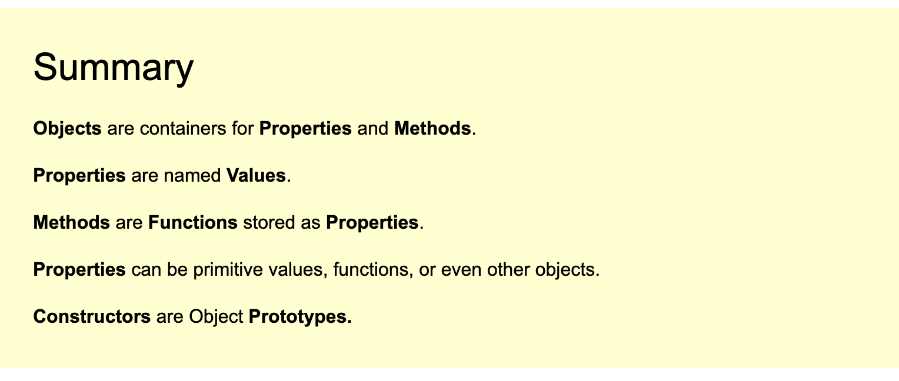

Summary

Objects are containers for Properties and Methods.
Properties are named values.
Methods are Functions stored as Properties.
Properties can be primitive values, functions ,or even other objects.
Constructors are Object prototypes.
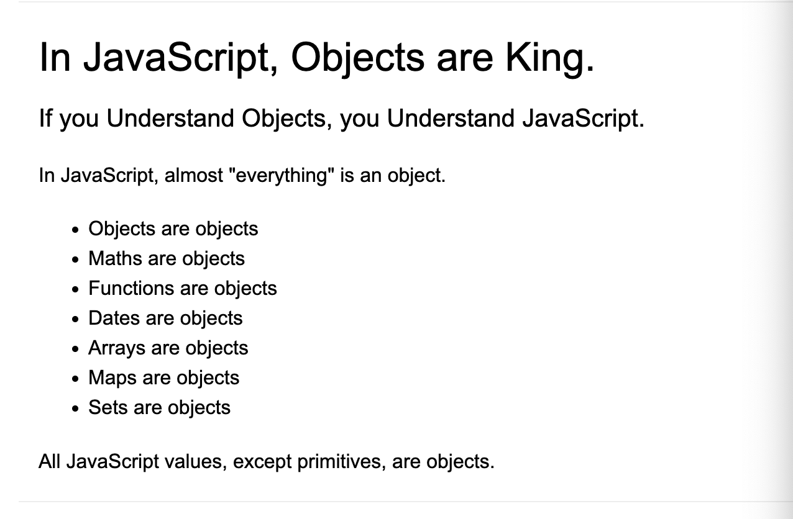
In JavaScrip,Objects are King.
If you Understand Objects, you Understand JavaScript.
In JavaScript ,almost "everything" is an object.
- Objects are objects
- Maths are objects.
- Functions are objects
- Dates are objects
- Maps are objects
- sets are objects
All JavaScript values, except primitives are objects.
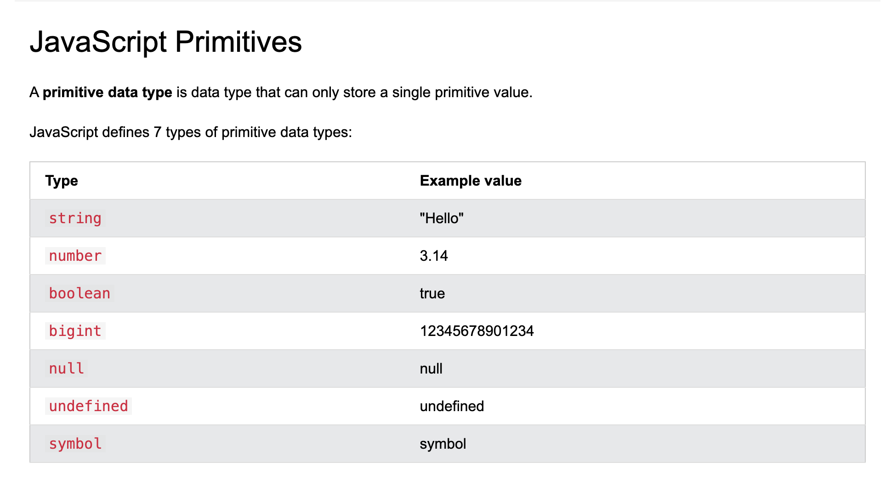
## JavaScript Primitives
A primitive data type is data type that can only store a single primitive value .
JavaScript defines 7 types of primitive data types.

|type| example value|
|----|--------------|
|string|"Hello"|
|number| 3.14|
|boolean|true|
|bigint|12345678901234|
|null|null|
|undefined|undefined|
|symbol |symbol|

## JavaScript Dates
[JavaScript Dates](https://www.w3schools.com/js/js_dates.asp)

## Note
Date objects are static. The "clock" is not "running."
The computer clock is ticking, data objects are not.

## JavaScript Date Output
By default, JavaScript will use t

## Displaying Dates
[Displaying Dates](https://www.w3schools.com/js/js_dates.asp);


JavaScript will (by default)output dates using the toString()method.This is a string
representation of the date, includeing the time zone. The format is specified in the 
ECMAScript specification:

## JavaScript Date Formats
[JavaScript Date Formats](https://www.w3schools.com/js/js_date_formats.asp)

## Date Input - Parsing Dates
Date.parse();
## JavaScript Get Date Method.
[Get Date](https://www.w3schools.com/js/js_date_methods.asp);

## The getMonth() Method
[The getMonth() Method](https://www.w3schools.com/js/js_date_methods.asp)

 ## The getDate() Method
 ## set The full year
 [set the full year](https://www.w3schools.com/js/js_date_methods_set.asp)

 ## JavaScript Arrays
 [JavaScript Arrays](https://www.w3schools.com/js/js_arrays.asp)

 An Array is an object type designed for storing data collections.

Key characteristics of JavaScript arrays are:

Elements: An array is a list of values, known as elements.

Ordered: Array elements are ordered based on their index.

Zero indexed: The first element is at index 0, the second at index 1, and so on.

Dynamic size: Arrays can grow or shrink as elements are added or removed.

Heterogeneous: Arrays can store elements of different data types (numbers, strings, objects and other arrays).

## Accessing Array Elements
[Accessing Array Elements](https://www.w3schools.com/js/js_arrays.asp)

## Arrays are Objects
Arrays are a special type of objects.The typeof operator in JavaScript returns "object" for arrays.
But, JavaScript arrays are best described as arrays.

## Array Elements Can Be Objects
```
myArray[0]=Date.now;
myArray[1]=myFunction;
myArray[2]=myCars;
```

## Array Properties and Methods
The real strength of JavaSAcript arrays are the built-in array properties and 
methods:
```
cars.length //Returns the number of elements
cars.sort() //Sorts the array

```

## The Differnece Between Array and Object.
- In JavaScript , ***array*** use numbered indexes.
- In javasCRIPT, **Object** use named indexes.
```
Arrays are a special kind of objects, with numbered indexes
```
## JavaScript new Array()
javaScript has a built-in array constructor new Array();
But you can safely use [] instead.
These tewo differnt statements both create a new empty array named points.
## How to recognize a array
typeof can not 
Array.isArray() or instance of exp: (fruits instanceof Array)

## JavaScript Array Methods
[JavaScript Array Methods](https://www.w3schools.com/js/js_array_methods.asp)

- JavaScript Array length
- javaScript POP() push()
- shift()
- delete()

## Changing Elements
Array elements are accessed using their index number:
Array elements are accessed using their index number:

```
Array indexes start with 0:
[0] is the first array element
[1] is the second
[2] is the third ...
```
## JavaScript Array length
The length property provides an easy way to append a new element to an array:
The length property provides an easy way to append a new element to an array:

## JavaScript Array delete()
```
Warning!
Using delete() leaves undefined holes in the array
use **pop()** and shit() to remove element.
```
## Merging Arrays (Concatenating)
[merging Arrays](https://www.w3schools.com/js/js_array_methods.asp)
Merging Arrays (Concatenating)
Merging Arrays (Concatenating)
In programming languages, concatenation means joining strings end-to-end.

Concatenation "snow" and "ball" gives "snowball".

Concatenating arrays means joining arrays end-to-end.

In programming languages, concatenation means joining strings end-to-end.
Concatenation "snow " and "ball" gives "snowball".
Concatenating arrays means joining arrays end-to-end.


## Flattening an Array
## JavaScript Array splice() 

## Automatic toString()
JavaScript automatically converts an array to a comma separated string when a primitive value is expected.

This is always the case when you try to output an array.

These two examples will produce the same result:
## JavaScript Array Search
[JavaScript Array](https://www.w3schools.com/js/js_array_search.asp)

## JavaScript Array search .
Array.lastIndexOf()is the same as the indexOf
## Array.find()
Array.find() method returns the value of the first array element that passes a test function. 
This example finds(returns the value of ) the first element that is larger than 1
- Array sort();
- Array reverse();
- Array tosorted()

## JavaScript Array Sort 
[JavaScript Array Sort](https://www.w3schools.com/js/js_array_sort.asp)

##  Find the lowest (or highest) array value
Find the Lowest (or Highest) Array Value
There are no built-in functions for finding the max or min value in an array.

To find the lowest or highest value you have 3 options:

Sort the array and read the first or last element
Use Math.min() or Math.max()
Write a home made function
## Find Min or Max with sort()
After you have sorted an array, you can use the index to obtain the highest and lowest values.

## Using Math.min() on an Array
```
Math.min.apply()

 function myArrayMin(arr){
                let len =arr.length;
                let min=Infinity;
                while(len--){
                    if(arr[len]<min){
                        min =arr[len];
                    }
                }
                return min;
            }
        </script>
```
## JavaScript Array Iterations
[JavaScript Array Iterations](https://www.w3schools.com/js/js_array_iteration.asp)

- JavaScript Array map()
[JavaScript Array](https://www.w3schools.com/js/js_array_iteration.asp)

The map() method creates a new array by performing a function on each 
array element.
The map() method does not execute the function for array elements without values.
The map() method does not change the original array.

This code is synchronous. **Array.prototype.map()** executes immediately and blocks until it completes, creating numbers2 right away without any asynchronous behavior.
Setting innerHTML on a DOM element also happens synchronously, updating the page content in the same execution context without deferring or waiting for external events/callbacks.

No asynchronous operations (e.g., promises, async/await, timers, network requests, or event listeners) are present here. The entire script runs from top to bottom in sequence during the current thread of execution.

[JavaScript Array filter](https://www.w3schools.com/js/js_array_iteration.asp)

[JavaScript Array reduceRight()](https://www.w3schools.com/js/js_array_iteration.asp)

## JavaScript Array reduceRight()
The reduceRight() method runs a function on each array element to produce a single value.
The reduceRight()works from right-to-left in the array. 
//
Note:reduceRight() method does not reduce the original array.

## JavaScript Array some()
The some() method checks if some array values pass a test.

## JavaScript 
[JavaScript Array Reference](https://www.w3schools.com/js/js_array_reference.asp)

## JavaScript
[JavaScript Array Const](https://www.w3schools.com/js/js_array_const.asp)

- Redeclaring or reassigning an array to const, in the same scope, or in the same block, is not allowed.
##  JavaScript Typed Arrays
https://www.w3schools.com/js/js_typed_arrays.asp

## Typed Arrays
[Typed Arrays](https://www.w3schools.com/js/js_typed_reference.asp)

## JavaScript Sets
[JavaScriptSets](https://www.w3schools.com/js/js_sets.asp)
```
A JavaScript Set is a collection of unique values.
Each value can only occur once in a set.
The values can be of any type, primitive values or objects.
```
## JavaScript SetMethods
[Setmethods](https://www.w3schools.com/js/js_set_methods.asp);

## The has() method 

##  The Union() method
[The union()](https://www.w3schools.com/js/tryit.asp?filename=tryjs_set_union)

## The isSupersetOf() Method
The isSupersetOf() method returns true if all elements in the argument set are also in this set:
## isDisjointFrom() Method
The isDisjointFrom()method returns true if this set has no elements in common with the argument set:

## Values must be Objects
Primitive values cannot be values in a WeakSet
The values must be objects.
This restriction is tied to the garbage collection mechanism.
primitives are not garbage collected in the same 
way as objects.

## Tracking Objects
A WeakSet is similar to a Set, but it only stores
objects, and holds them weakly.If there are no other 
references to an object, 
it gets garbage collected automatically.
This makes it handy for tracking objects, without storing 
extra data(like counts).
## Automatic Cleanup
If you remove all references to a visitor object.
John =null
## Note Iterable

WeakSets are not enumerable.
You cannot iterate over the values with for loops, forEach(), or values().
You cannot access the size ,WeakSets have no size property.

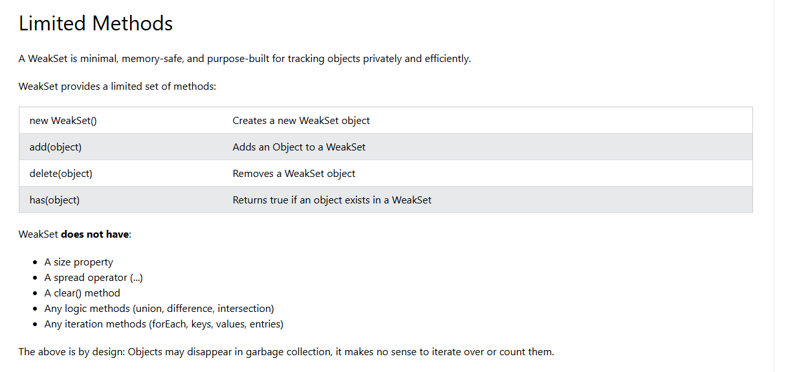

## JavaScript Maps
[JavaScript Maps](https://www.w3schools.com/js/js_maps.asp)
The Map Object 
A Map object holds key-value pairs where the keys can be any datatype.
A Map also remembers the original indertion order of the keys.


## JavaScript Map Methods
[JavaScript Map](https://www.w3schools.com/js/js_map_methods.asp)

## **object** is the key of Map()
[Map-OBject](https://www.w3schools.com/js/js_map_methods.asp)


The Map.groupBy() method to JavaScript.
The Map.groupBy() method groups elements of an object according 
to **String values returned from a callback function.**

## JavaScript WeakMap、
[JavaScript WeakMap](https://www.w3schools.com/js/js_maps_weak.asp)
The WeakMap Object 
A javasScript WeakMap is a collection of key/value pairs where the keys must 
be objects.
A weakMap holds weak references to its keys.

## Weak References
[Weak References](https://www.w3schools.com/js/js_maps_weak.asp)
UNLIKE A  regular Map,
a WeakMap does not prevent its keys from beging 
garbage collected.
If a key(an object ) has no references to it 
in a program, it becomes eligible for 
garbage collection.
When the key is garbage collected,
its key-value pair is removed from the WeakMap.


## Weak Map Secret Data
## JavaScript Math
[JavaScript Math Object](https://www.w3schools.com/js/js_math.asp)

JavaScript 的 Math 物件提供以下數學常數，並在程式碼中顯示：Math.E：自然對數的底數（歐拉數），約為 2.718。
Math.PI：圓周率，約為 3.14159。
Math.SQRT2：2 的平方根，約為 1.414。
Math.SQRT1_2：1/2 的平方根（即 1/√2），約為 0.707。
Math.LN2：2 的自然對數，約為 0.693。
Math.LN10：10 的自然對數，約為 2.303。
Math.LOG2E：以 2 為底的 Math.E 對數，約為 1.443。
Math.LOG10E：以 10 為底的 Math.E 對數，約為 0.434

## JavaScript Math Reference.
[Math.log](https://www.w3schools.com/js/js_math_reference.asp)

[A Proper Random Function](https://www.w3schools.com/js/js_random.asp)


## JavaScript RegExp
[JavaScript RegExp](https://www.w3schools.com/js/js_regexp.asp)

Regular Expressions
A regular expression is a sequence of characters that forms a search pattern.
Regex is a common shorthand for a regular expression.
JavaScript RexExp  is an Object for handing RegularExpressions.
RegExp are be used for:
- Text searching
- Text replacing
- Text validation
## Regular Expression
/w3schools/i is a regular expression.
w3schools is a pattern(to be used in a search).
i is a **modifier** (modifies the search ot be case-insensitive).

## Regular Expression Syntax.
```
/pattern/modifier flags;
```


## Using String match()

## JavaScript Regex Flags
```
/pattern/flags
```
Regular expression flags are parameters that can mofify how a pattern is used,
such as making case-insensitive or global
|Flag|Descripton|details|
|----:|---------|--------|
|/g| performs a global match(find all)|--|
|/i| Performs case-insensitive matching|--|
|/u|Enables Unicode support(new 2015)


The /g Flag (Global) matches all occurrences of the pattern, rather than just the first one.,

## RexExp Metacharacters
```
const pattern =/\w/;
```
Match words
Metacharacters are characters with a special meaning 
They can be used to match digts, words,spaces,and more.
Tese are the most common:
|Meta|Description|
|----:|-----------|
|\d|Matches Digits|
|\w|Matches Words|
|\s| Matches Spaces|

## RegExp Quantifiers
```
//Match at least one zero
const pattern =/0+/;
```
|Code|Description|
|---:|---|
|x* |Matches zero or more occurences of x|
|x?|Matchs zero or one occurrences of x|
|x{n}|Matches n occurences of x|
/10?/g -> 匹配 "1" 或 "10"（结果示例：["1","10","10"]）
/10*/g -> 匹配 "1"、"10"、"100"、"1000" 等（在你的字符串里会得到 ["1","100","1000"]）
/10+/g -> 匹配至少有一个零的情况（在你的字符串里得到 ["100","1000"]）

Regular Expression Assertions
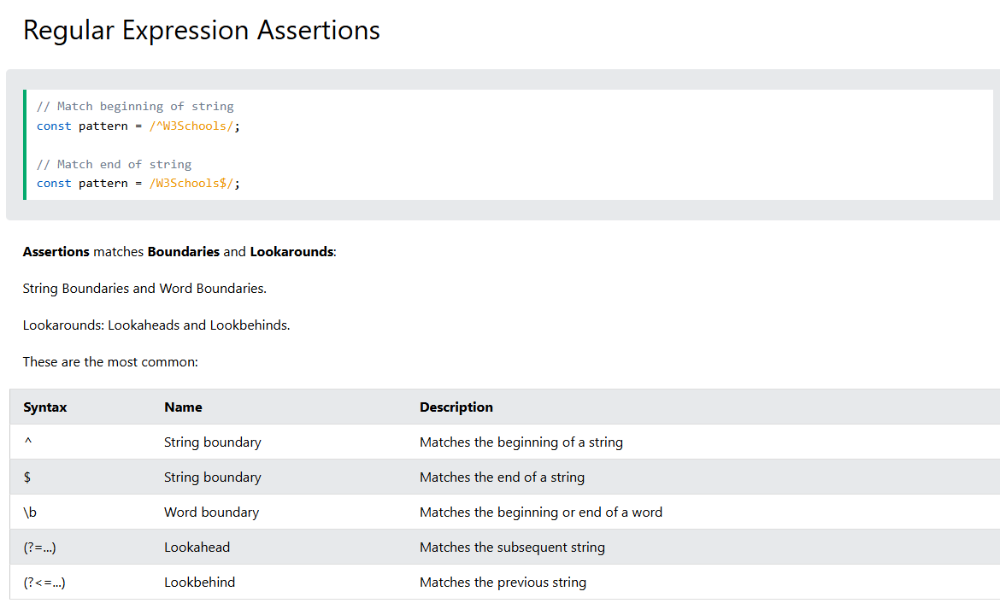

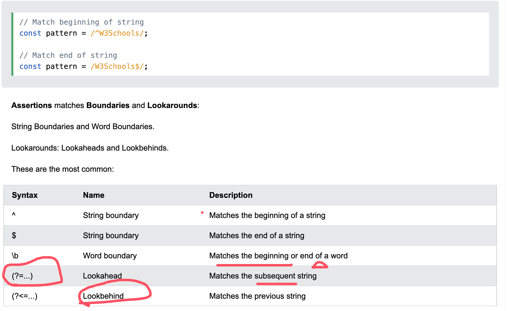
## JavaScript RegExp Flags
[JavaScript RegExp Flags](https://www.w3schools.com/js/js_regexp_flags.asp)
RegExp Modifier Flags
Flags are parameters that can modify how a regex pattern is used, such as making 
it case insensitive
```
/pattern/flags
```


## Note
The example above uses a regex metacharacter /\w+/.
The meaning of /\w+/ is "match any word"

**Note** the /v flag as an "upgrade" to the /u flag.
The /v flag enables more Unicode-related features/

## RegExp /v Flag (Unicode Sets)

The \p escape sequence matches strings,instead of just characters.
The character calss is upgraded to allow intersecton, union,and subtraction syntaxes,
as well as matching multiple Unicode characters.\

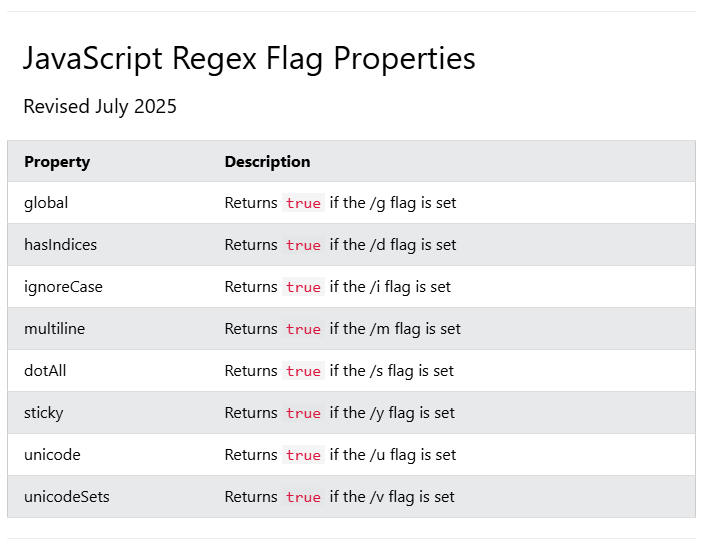
## RegExo Group Modifierss(?flag)
The (?flag) syntax is a group modifier(inline flag modifier).
It allows for modifying flags in a part of a pattern ,rather than to the entire pattern
(?flags:pattern) enables the flags only for the pattern in the group.

## JavaScript Regex Flag Properties
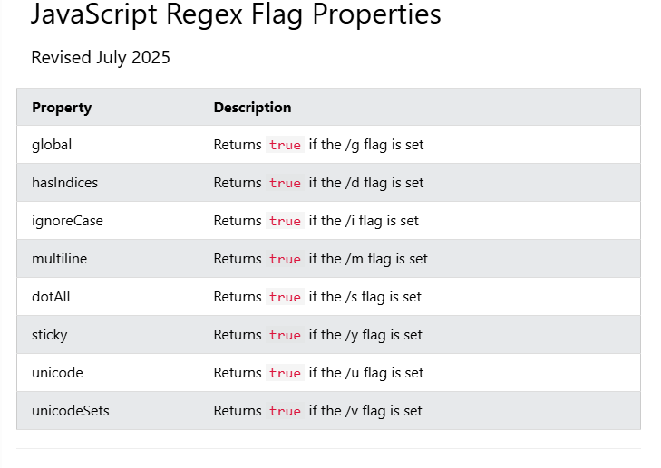
## Regular Expression Methods
[Regular Expresson](https://www.w3schools.com/js/js_regexp_flags.asp)

## RegExp Character Classes
[RegExp Character class](https://www.w3schools.com/js/js_regexp_characters.asp)
Character Classes are characters enclosed in square brackets[];
A character class matches any character from a set winth brackets:
```
//Match Digits
const pattern=/[0-9]/;
```

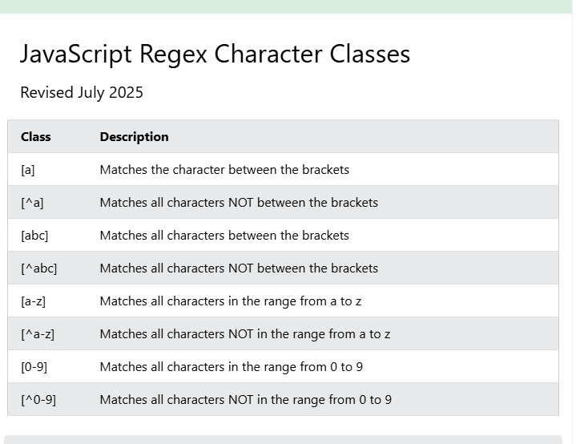

## Regular Expression Methods

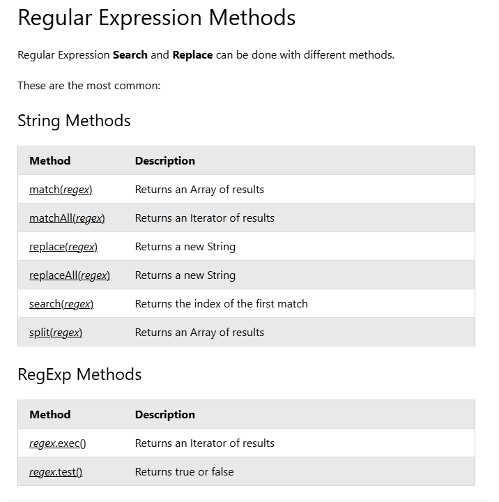

## https://www.w3schools.com/js/js_regexp_assertions.asp

## The \b Metacharacter
The \b metacharacter matches the beginning of a word or the end of a word.


## RegExp Group MOdifiers(?flag)
[RegExp Group Modifiers](https://www.w3schools.com/js/js_regexp_assertions.asp)

The (?FLAG) SYNtax is a group modifier (inline flag modifier).
It allows for modifying flags in a part of a pattern, rather than to the entire pattern.
(?flag:pattern) enables the flags only for the pattern in the group.

## RegExp Quantifiers 
[RegExp Quantifiers](https://www.w3schools.com/js/js_regexp_quantifiers.asp);

## RegExp + Quantifier
X+ matches matches at least
```
<script>
    let text = "Hellooo World! Hello W3Schools!";
    // 定义一个字符串，里面包含多个 "lo"、"loo"、"looo" 等子串

    const pattern = /lo*/g;
    // 正则表达式：
    //   l      —— 匹配字符 'l'
    //   o*     —— 匹配 0 个或多个 'o'（* 是量词）
    //   g      —— 全局匹配（global），会把字符串中所有符合条件的子串都找出来

    let result = text.match(pattern);
    // 使用 String.prototype.match() 方法
    // - 当正则带有 g 标志时，返回一个数组，数组的每一项是匹配到的子串
    // - 如果没有匹配到任何内容，返回 null

    document.getElementById("demo").innerHTML = result;
    // 把匹配结果（数组）直接赋值给某个 <p id="demo"> 元素的 innerHTML
    // 数组在 HTML 中会自动被转成逗号分隔的字符串
</script>
```

## JavaScript RegExp patterns
[RegExp Singnals](https://www.w3schools.com/js/js_regexp_patterns.asp)
## JavaScript RegExp Objects
[The RegExp Object](https://www.w3schools.com/js/js_regexp_objects.asp)

The RegEXP Object 
In JavaScript, RegEXPP is a regular expression object with predefined properties and  methhods.

## RegExp Methods 
[RegExp Methods](https://www.w3schools.com/js/js_regexp_methods.asp)

## JavaScript Data Types
[JavaScript](https://www.w3schools.com/js/js_datatypes.asp)
```
// Strings 
let color = "Yellow";
let lastName ="Johnson";

// Number
let length =16;
let weight =7.5;

// BigInt
let x =1234567890123456789012345n;
let y =BigInt(1234567890123456789012345);
//Boolean
let x =true;
let y=false;

//Object
const person={firstName:"Jonh" ,lastName:"Doe"};

//Array object
const cars =["Saab","Volvo",];
// Date object
const date =new Date("2022-03-25");

//underfined
let x;
let y;

// Null
let x = null;
let y = null;

//Synmbol
const x =Symbol();
const y=Symbol();
```

## The concenpt of Data types
In programming, data types is an important concept.
To be able to operate on variables, it is important to know something about the type.
Without data types, a compurter cannot safely solve this:
```
let x =16 + "tesla";
```
The javaScript will treat x 16 as a string.

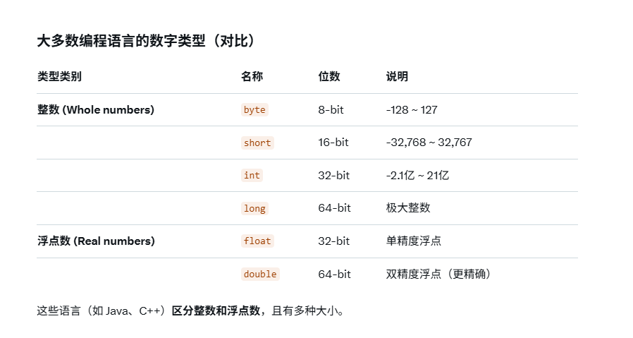


## Type of object
[Type of object](https://www.w3schools.com/js/js_datatypes.asp)

## JavaScript toString()
[JavaScript to string](https://www.w3schools.com/js/js_tostring.asp)


[JavaScript Type Conversion](https://www.w3schools.com/js/js_type_conversion.asp)

## JavaScript Errors
[JavaScript Errors](https://www.w3schools.com/js/js_errors_intro.asp)

## JavaScript Silent Errors
[JavaScript Silent Errors](https://www.w3schools.com/js/tryit.asp?filename=tryjs_errors_silent1)
## JavaScript
[JavaScript](https://www.w3schools.com/js/js_errors.asp)
## JavaScript Error Reference
[JavaScript Error Reference](https://www.w3schools.com/js/js_error_object.asp)
## JavaScript Debugging
[JavaScript Debugging](https://www.w3schools.com/js/js_debugging.asp)

Errors can (will) happen,every time you write some new computer code.

Often,when programming code contains errors,nothing will happen.
There are no error messages,and you will get no indications
where to search for errors.

**Searching for (and fixing)** errors in programming code is called code debugging.

With a debugger,you can also set breakpoints (places where code execution can be stopped),and examine variables while
the code is executing.

## Setting BreakPoints
In the debugger window,you can set breakpoints in the javaScript code.
At each breakpoint,JavaScript will stop executing, and let you 
examine JavaScript values.
After examining values, you can resume the execution of code(typically with a play button.)
## Interesting story
Debugging is the process of testing,finding, and reducing bugs(errors) in computer programs.
The first know computer bug was a real bug (an insect) stuck in the electronics.
## HTML Event
[HTML Event](https://www.w3schools.com/js/js_events.asp)

- An HTML web page has finished loading
- An HTML input field was changed
- An HTML button was clicked

JavaScript lets you execute code when events are detected.

HTML allows event handler attributes, with JavaScript code, to be added to 
HTML  elements.
With single quotes:
```
<element event='some JavaScript'>
```
With double quotes:
```
<element event="some JavaScript">
```
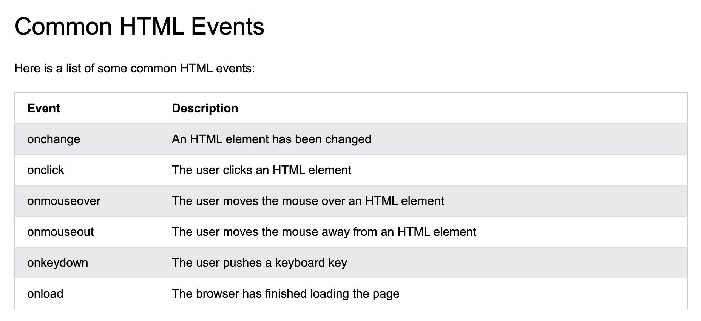

## JavaScript Event Handlers
Event handlers can be used to handle and verify user input,
user actions, and browser actions:
- Thins that should be done every time a page loads
- Things that should be done when the page is closed
- Action that should be performed when a user clicks a button
- Content that should be verified when a user inputs data
## JavaScript Scope
[JavaScript Scope](https://www.w3schools.com/js/js_scope.asp)
Scope = visibility
- Global scope
- Function scope
- Block scope

A variable declared outside a function, become Global

## Local Variables has Function Scope
- They can only be accessed from within the function.
- No scripts or functions outside the function can access them
- variables with the same name can be used outside the function
- variables with the same name can be used in different functions
- Local variables are created when a function starts
- Local variables are deleted when the function is completed
- Arguments(parameters) work as local variables inside functions.

## Automatically Global
If you assign a value to a variable that has not been declared. it will become a Global variable.
This code example will declare a global variable  carName,even if the value is assigned inside a function.
## Strict MOde 
in "Strict Mode", undeclared variables are not automatically global.

## Global variables in HTML
With JavaScript, the global scope is the JavaScript environment.
In HTML, the global scope is the window object.
**Notice**
Global variables defined with the var 